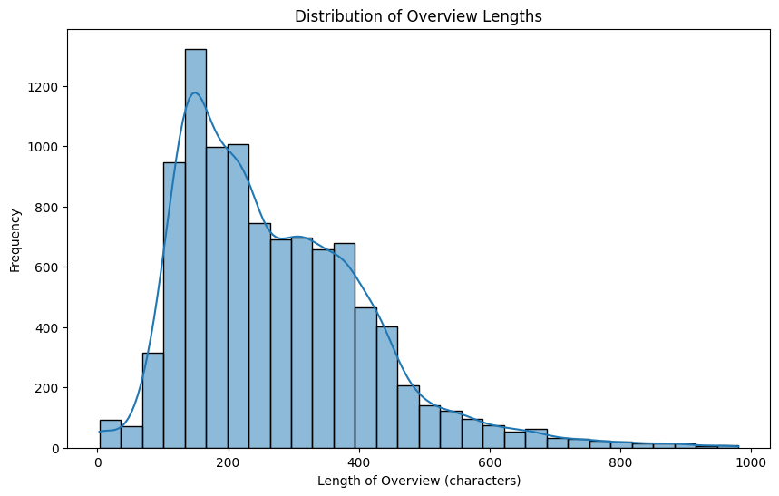
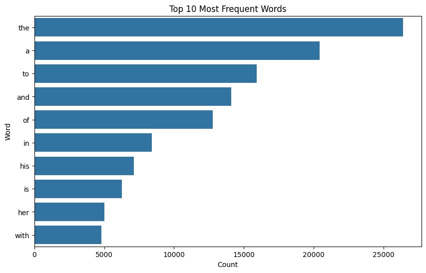
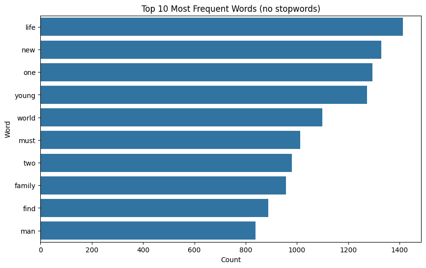

# A2_MCDA_5511
Assignment 2 for MCDA 5511

To get the code to run you must

1. Run "uv sync"
2. Select the python "3.10.16" kernal
3. Run .venv\Scripts\Activate
4. Run .venv\Scripts\python.exe -m ensurepip --upgrade
5. Run .venv\Scripts\python.exe -m pip install ipykernel

If you are on Mac you may need to switch every '\' to a '/' in the above commands.

## Question 1

### Sampling / Processing

We had originally looked into sampling our data to make it more manageable, however upon futher research we found that the downsides to doing so did not outweigh the benefits. Too much bias would be introduced into the training of the model, and the dataset was not big enough that the performance would increase substantially.

For an example of bias, If we used something like stratified sampling, the only way we found to divide up the data would be by looking at the movie genres. This causes issue because some movies fall into multiple genres, so looking at every possible combination would yeild 9033 unique classifications. Since groups must be mutually exclusive, stratified sampling would be of no use to us.

There cold be some merit in clustered sampling, however we decided that our dataset would be small enough that sampling was not needed.

### Statistics
We ran some calculations to find some basic statistics of our data set. Here is a graph showing the spread of document length:

We found that the average length of an overview was 272.23 characters.

As for vocabulary, we ran 2 tests. One to find the most common words, and one to find the most common words (excluding stopwords):

